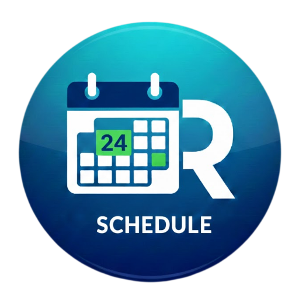
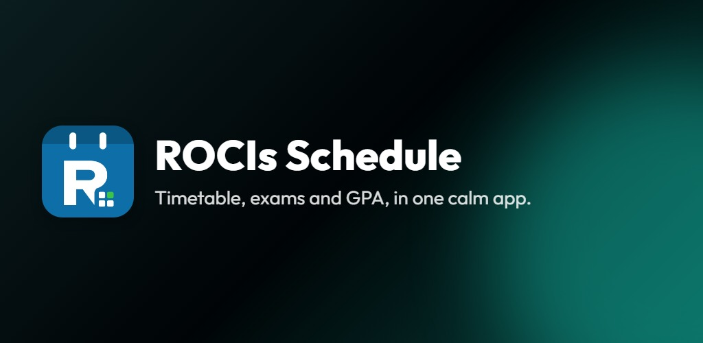
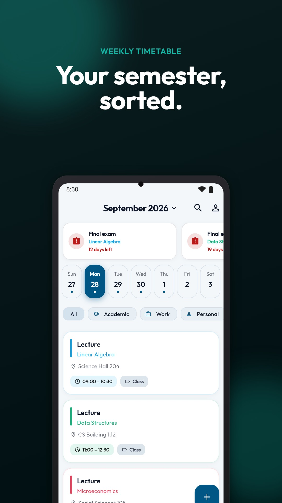
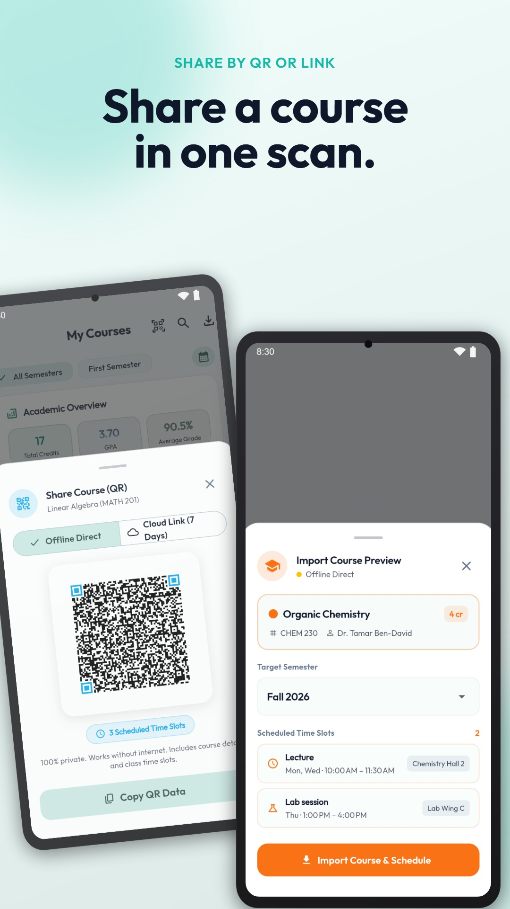
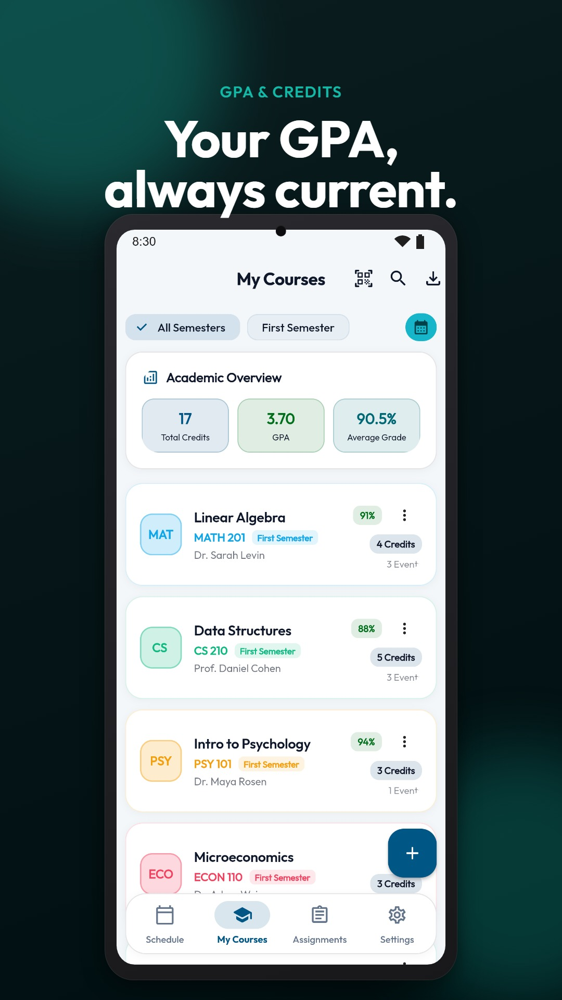
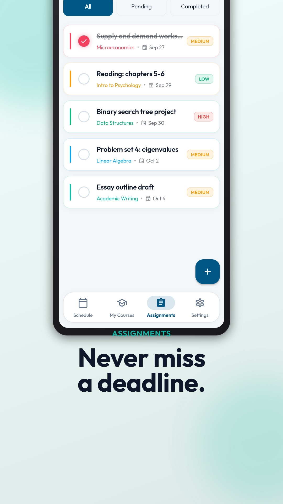
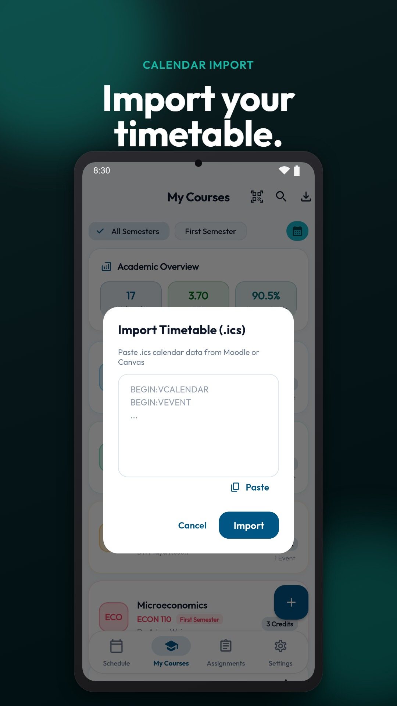
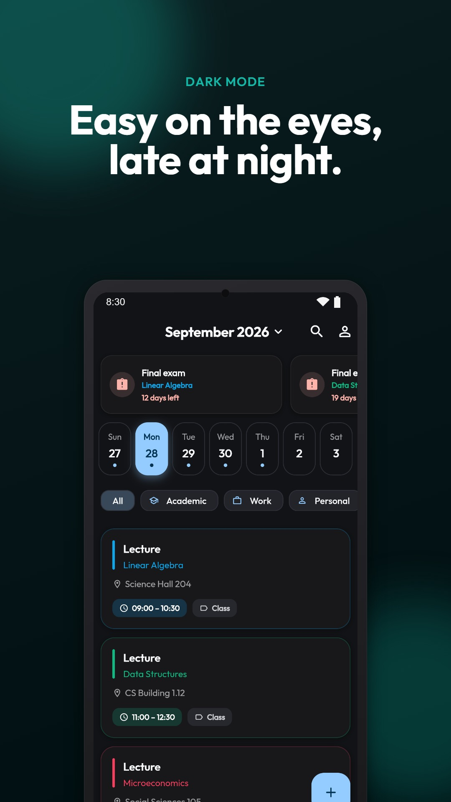
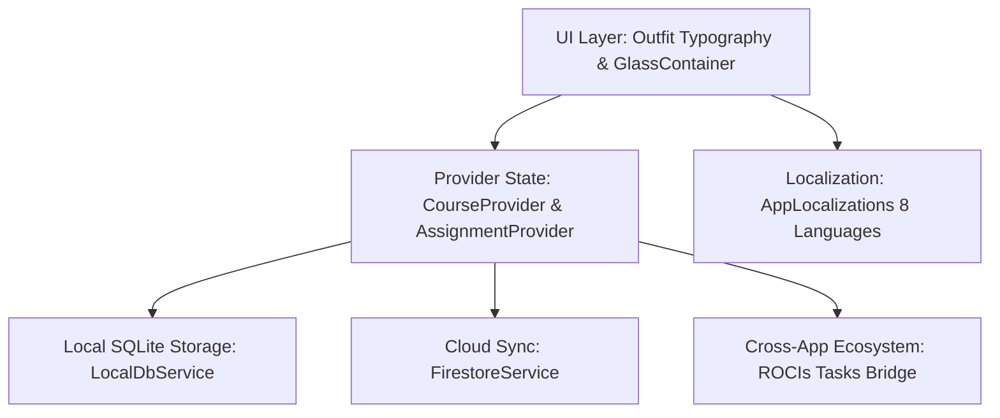

<div align="center">

  

  # 🎓 ROCIs Schedule
  **The Next-Generation Academic Timetable & GPA Management Assistant**

  [](https://flutter.dev)
  [](https://dart.dev)
  []()
  []()
  []()
  [](LICENSE)

  <br />

  

</div>

---

## 🌟 Overview

**ROCIs Schedule** is an offline-first academic management app designed for students and educators. Built with Flutter and adhering to ROCIs Design System, it unifies weekly lecture schedules, live exam countdown alerts, weighted GPA simulations, assignment tracking, and 1-tap `.ics` calendar imports from Canvas, Moodle, and Google Calendar.

---

## ✨ Features

- 📅 **Weekly Interactive Timetable:**
  - Day-strip navigation with live event dots (red for exams, indigo for classes/labs).
  - Quick category filtering (*All*, *Classes*, *Exams*, *Labs*, *Study*).
  - Micro-haptic tactile feedback on tap.

- ⏰ **Live Exam Countdown Alerts:**
  - Real-time countdown banners for impending exams (*Today*, *Tomorrow*, *X days left*).
  - Classroom location, instructor tags, and course color accents.

- 📊 **Academic Overview & GPA Tracker:**
  - Support for decimal course credits (`1.5`, `3.5`, `0.25`).
  - Real-time weighted GPA conversion on 4.0 scale with floating-point drift protection.
  - Division-by-zero resilient calculation for courses with zero graded credits.

- 📥 **Universal .ICS Calendar Importer:**
  - 1-tap import from Canvas, Moodle, Blackboard, and Google Calendar.
  - Automatic event type detection (Lectures, Exams, Labs, Recitations).
  - Multi-line folded text unfolding and Hebrew/Unicode character support.

- ✅ **Assignment Management & ROCIs Tasks Sync:**
  - Filter tabs (*All*, *Pending*, *Completed*) and sorting (*Due Date*, *Priority*).
  - 1-tap ecosystem bridge export to **ROCIs Tasks** via deep link (`roci-tasks://create-task`).

- 🌙 **True AMOLED Pitch-Black Mode & Glassmorphism:**
  - Battery-saving pure black mode (`#000000`) with subtle translucent borders.
  - Frosted glass containers (`GlassContainer`) with adaptive contrast.
  - Material You dynamic color adaptation.

- 🌍 **Multilingual Localization:**
  - Full bidirectional support across 8 languages: English, Hebrew (RTL), Spanish, German, French, Arabic (RTL), Hindi, and Swedish.

---

## 📸 Screenshots

<div align="center">
  <table>
    <tr>
      <td width="33%"></td>
      <td width="33%"></td>
      <td width="33%"></td>
    </tr>
    <tr>
      <td align="center"><b>Weekly Timetable</b></td>
      <td align="center"><b>Course Sharing (QR / Link)</b></td>
      <td align="center"><b>GPA & Credits</b></td>
    </tr>
    <tr>
      <td width="33%"></td>
      <td width="33%"></td>
      <td width="33%"></td>
    </tr>
    <tr>
      <td align="center"><b>Assignments</b></td>
      <td align="center"><b>Calendar Import</b></td>
      <td align="center"><b>Dark Mode</b></td>
    </tr>
  </table>
</div>

---

## 🛠️ Architecture & Tech Stack



- **Framework:** Flutter 3.x / Dart 3.x
- **State Management:** `provider`
- **Persistence:** `sqflite` (Offline-first local SQLite cache) & `shared_preferences`
- **Cloud Backend:** Firebase Auth & Cloud Firestore
- **UI & Theming:** Google Fonts `Outfit`, `GlassContainer`, ROCIs Design Tokens
- **Routing:** `go_router`
- **Testing:** 69 exhaustive unit, widget, and adversarial stress tests (`ruthless_edge_cases_test.dart`)

---

## 🚀 Getting Started

### Prerequisites
- [Flutter SDK](https://docs.flutter.dev/get-started/install) (version >= 3.0.0)
- [Android Studio](https://developer.android.com/studio) or VS Code with Flutter extension
- Java JDK 17+

### Installation & Run

```bash
# Clone the repository
git clone https://github.com/RoeeIlouz/ROCIs-Schedule.git
cd ROCIs-Schedule

# Get dependencies
flutter pub get

# Run static analysis
flutter analyze

# Run all 69 automated tests
flutter test

# Launch the app in debug mode
flutter run
```

### Build Release APK

```bash
# Build standalone release APK
flutter build apk --release

# The compiled APK is located at:
# build/app/outputs/flutter-apk/app-release.apk
```

---

## 📄 License

This project is licensed under the MIT License - see the [LICENSE](LICENSE) file for details.