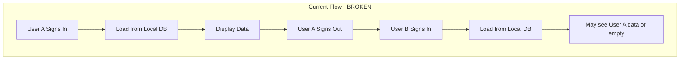
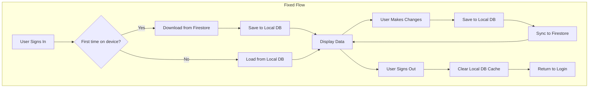
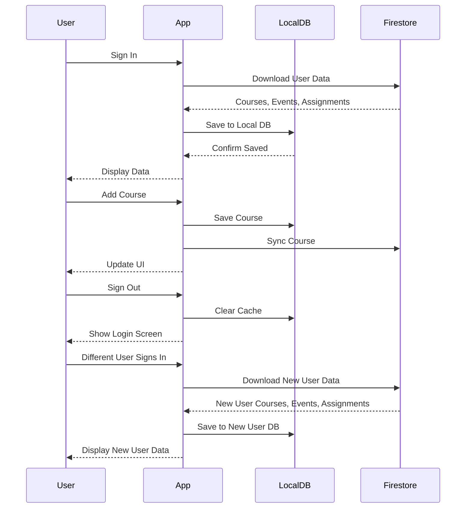

# User Data Sync & Isolation Fix Plan

## Problem Statement

When multiple users sign in on the same device, they can see each other's courses and assignments. The data is not properly synced to/from the user's profile in Firestore.

## Root Cause Analysis

### Current Architecture Issues



1. **No Data Download from Firestore**: The `SyncService` only uploads data to Firestore but never downloads. When a user logs in on a new device or after another user, their cloud data is not fetched.

2. **Incomplete Sign-Out Cleanup**: When signing out, `LocalDbService.clearCache()` is never called, potentially leaving stale database connections.

3. **Missing Firestore Download Methods**: `FirestoreService` lacks methods to download courses, events, and assignments from Firestore.

4. **Provider Initialization**: Providers load data from local DB only, not from Firestore when user changes.

## Proposed Solution

### Architecture Overview



### Implementation Steps

#### 1. Add Download Methods to FirestoreService

Add methods to download user data from Firestore:

```dart
// In firestore_service.dart
Future<List<Course>> downloadCourses(String uid) async {
  final snapshot = await _db
      .collection('users')
      .doc(uid)
      .collection('courses')
      .get();
  return snapshot.docs.map((doc) => Course.fromMap(doc.data())).toList();
}

Future<List<ScheduleEvent>> downloadEvents(String uid) async {
  final snapshot = await _db
      .collection('users')
      .doc(uid)
      .collection('events')
      .get();
  return snapshot.docs.map((doc) => ScheduleEvent.fromMap(doc.data())).toList();
}

Future<List<Assignment>> downloadAssignments(String uid) async {
  final snapshot = await _db
      .collection('users')
      .doc(uid)
      .collection('assignments')
      .get();
  return snapshot.docs.map((doc) => Assignment.fromMap(doc.data())).toList();
}
```

#### 2. Update SyncService with Download Capability

Modify `SyncService` to support bidirectional sync:

```dart
// In sync_service.dart
Future<void> downloadAndMergeData() async {
  final user = _authService.user;
  if (user == null) return;

  try {
    debugPrint('Downloading data from Firestore...');
    
    // Download courses
    final remoteCourses = await _firestoreService.downloadCourses(user.uid);
    for (var course in remoteCourses) {
      await _courseProvider.addCourseFromSync(course);
    }
    
    // Download events
    final remoteEvents = await _firestoreService.downloadEvents(user.uid);
    for (var event in remoteEvents) {
      await _courseProvider.addEventFromSync(event);
    }
    
    // Download assignments
    if (_assignmentProvider != null) {
      final remoteAssignments = await _firestoreService.downloadAssignments(user.uid);
      for (var assignment in remoteAssignments) {
        await _assignmentProvider!.addAssignmentFromSync(assignment);
      }
    }
    
    debugPrint('Download completed successfully.');
  } catch (e) {
    debugPrint('Download failed: $e');
  }
}
```

#### 3. Update AuthService to Clear Cache on Sign-Out

```dart
// In auth_service.dart
Future<void> signOut() async {
  await LocalDbService.clearCache(); // Clear database cache
  await _googleSignIn.signOut();
  await _auth.signOut();
}
```

#### 4. Update Providers with Sync Methods

Add methods to providers that allow adding data from sync without triggering another sync:

```dart
// In course_provider.dart
Future<void> addCourseFromSync(Course course) async {
  await _dbService.insertCourse(course);
  // Don't call loadData() to avoid triggering sync
  _courses.add(course);
  notifyListeners();
}

Future<void> addEventFromSync(ScheduleEvent event) async {
  await _dbService.insertEvent(event);
  _events.add(event);
  notifyListeners();
}
```

```dart
// In assignment_provider.dart
Future<void> addAssignmentFromSync(Assignment assignment) async {
  await _db.insertAssignment(assignment);
  _assignments.add(assignment);
  notifyListeners();
}
```

#### 5. Trigger Initial Sync on Login

Update the login flow to trigger a data download:

```dart
// In login_screen.dart - _handlePostLogin method
Future<void> _handlePostLogin(String uid) async {
  final profile = await context.read<FirestoreService>().getProfile(uid);
  
  // Trigger initial sync from Firestore
  final syncService = context.read<SyncService?>();
  if (syncService != null) {
    await syncService.downloadAndMergeData();
  }
  
  if (mounted) {
    if (profile.exists) {
      context.go('/schedule');
    } else {
      context.go('/onboarding');
    }
  }
}
```

#### 6. Update Main.dart Provider Setup

Ensure providers properly reinitialize when user changes:

```dart
// In main.dart - CourseProvider proxy
ChangeNotifierProxyProvider<AuthService, CourseProvider?>(
  create: (_) => null,
  update: (_, auth, previous) {
    if (auth.user == null) {
      // Clear cache when user logs out
      LocalDbService.clearCache();
      return null;
    }
    if (previous?.userId == auth.user!.uid) return previous;
    // Create new provider for new user
    return CourseProvider(auth.user!.uid)..loadData();
  },
),
```

### Data Flow Diagram



### Files to Modify

| File | Changes |
|------|---------|
| `lib/shared/services/firestore_service.dart` | Add download methods for courses, events, assignments |
| `lib/shared/services/sync_service.dart` | Add `downloadAndMergeData()` method |
| `lib/features/auth/auth_service.dart` | Call `LocalDbService.clearCache()` on sign-out |
| `lib/features/courses/course_provider.dart` | Add `addCourseFromSync()` and `addEventFromSync()` methods |
| `lib/features/assignments/assignment_provider.dart` | Add `addAssignmentFromSync()` method |
| `lib/features/auth/login_screen.dart` | Trigger initial sync after login |
| `lib/main.dart` | Update provider setup to clear cache on logout |

### Testing Scenarios

1. **New User on Fresh Device**: User signs in, data should be downloaded from Firestore
2. **Existing User on New Device**: User signs in, existing cloud data should appear
3. **User Switch on Same Device**: User A signs out, User B signs in, User B should only see their data
4. **Offline Mode**: User should be able to work offline, data syncs when online
5. **Data Conflict**: Handle case where local and remote data differ (use last-write-wins or merge strategy)

### Edge Cases to Handle

1. **Network Errors**: Gracefully handle failed downloads, show user feedback
2. **Empty Firestore Data**: New user with no cloud data should start fresh
3. **Partial Sync Failures**: If some data fails to sync, retry mechanism
4. **Concurrent Modifications**: Handle race conditions between devices

## Implementation Priority

1. **Critical**: Add Firestore download methods and trigger on login
2. **Critical**: Clear local DB cache on sign-out
3. **High**: Update providers with sync-safe methods
4. **Medium**: Add error handling and retry logic
5. **Low**: Add conflict resolution for multi-device scenarios
